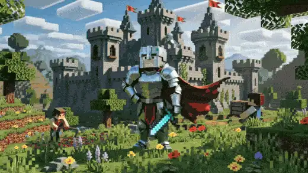
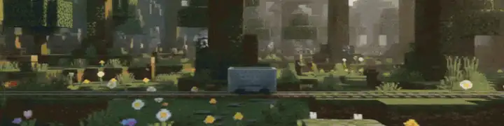

 
 

&nbsp;
&nbsp;
&nbsp;

 

🎮 &nbsp;flavor on the surface &nbsp;·&nbsp; 🔬 &nbsp;science inside the folds — <em>click the ▸ panels as you go</em>

##  &nbsp;model card — `karan-v3`

*Every model ships with a card. This one is self-reported but honestly benchmarked.*

 

| field | value |
|---|---|
| **architecture** | curiosity-driven · chai-cooled · stubbornly empirical |
| **pretraining** | B.E. Computer Science (9.33/10) → production ML internship |
| **fine-tuning** | M.Sc. Computer Science (AI) · University of Freiburg 🇩🇪 |
| **alignment** | to measured baselines — vibes are not an eval |
| **known limitations** | will re-run your experiment with 3 seeds before agreeing with it |
| **intended use** | research collaborations · working-student roles · hard problems |

&nbsp;🔬 &nbsp;<b>full spec sheet</b> — the verifiable part

 

| | |
|---|---|
| M.Sc. Computer Science (AI) | Albert-Ludwigs-Universität Freiburg, Apr 2025 → present. Deep learning, probabilistic graphical models, statistical pattern recognition, robot mechanics. |
| B.E. Computer Science | N.M.A.M. Institute of Technology, 2020 → 2024. GPA 9.33/10 (German equivalent 1,3). |
| ML Intern | WiZdom Ed, Oct 2023 → Oct 2024. Production RAG over 5,000+ documents (LangChain + ChromaDB); ingestion −40% via recursive splitting; cosine-similarity feedback loop → 90% answer accuracy. |
| Certifications | [MLOps Specialization, Duke](https://coursera.org/verify/specialization/BC9VRBWCQRU5) · [ML Specialization, Stanford/DeepLearning.AI](https://coursera.org/verify/specialization/JDYYP28JPJNZ) |
| Languages | English C2 · Hindi native · German A2 → B1 |
| Base of operations | Freiburg im Breisgau, DE · CET |

<code>the training soundtrack · live</code>

<!-- spotify direct widget (needs Premium) parked at karanchan02125.pythonanywhere.com — swap back anytime -->

##  &nbsp;currently mining

*Two active veins. The minecart runs daily.*

🟢 &nbsp;**[mamba-hybrid-lm](https://github.com/Karan-Anchan/mamba-hybrid-lm)** — a ~50M Mamba-2 × attention hybrid LM, trained three ways to answer one question: how few attention layers can you get away with? **1:7 currently leads**

🔵 &nbsp;**[edge-yolo26-deployment](https://github.com/Karan-Anchan/edge-yolo26-deployment)** · **[live demo ▸](https://karan-anchan.github.io/edge-yolo26-deployment/)** — one detector, three runtimes; the latency-per-watt answer turned out to be **FP16/FP8, not INT8**. Detection runs in your browser tab (webcam mode next)

&nbsp;🔬 &nbsp;<b>run configs</b> — what's actually inside

 

**mamba-hybrid-lm** · *in progress — the ratio study*
- Interleaves [Mamba-2](https://arxiv.org/abs/2405.21060) selective-SSM blocks with causal attention (the [Jamba](https://arxiv.org/abs/2403.19887) pattern) — d_model 768 · bf16 · SwiGLU · RoPE · trained on OpenWebText, one RTX 5070 12GB
- Sweeps the attention:SSM ratio — **1:3 / 1:7 / 1:15** — at matched tokens-seen; reduced-scale preview: **1:7 wins val PPL (102.4)**, 1:3 trains fastest
- The real payoff is at inference: attention's KV-cache grows with context, Mamba's state doesn't — KV-cache @ 8K and tok/s columns land next, then a live token-streaming demo

**edge-yolo26-deployment** · *shipped · [live WebGPU demo](https://karan-anchan.github.io/edge-yolo26-deployment/)*
- NMS-free YOLO26 fine-tune (SKU-110K dense shelves, mAP@50-95 **0.572**) shipped as **one ONNX graph → TensorRT** (RTX 5070), **ONNX Runtime** (Ryzen 7700) and **WebGPU** in-browser
- MLPerf-style p50/p95 latency + NVML power. Verdict: **FP8 = 560 FPS**, **FP16 wins latency-per-watt** (9.3 FPS/W, near-lossless), and **INT8 is dominated on Blackwell** — slower *and* hungrier than both
- The two "INT8"s disagree ~8× on accuracy loss (TensorRT −5.65% vs ONNX Runtime −0.72%) — traced to quantization granularity + head sensitivity; the CPU path gets there with per-channel quantization and an FP32 detection head
- Detection runs 100% client-side; the frame never leaves the browser

##  &nbsp;changelog

*Version history of the author. Semantic-ish.*

<table>
<tr>
<td rowspan="8" width="150" align="center" valign="middle"></td>
<th></th><th>release</th><th>notes</th>
</tr>
<tr><td></td><td><code>v2026.07</code></td><td><b>feat:</b> <a href="https://github.com/Karan-Anchan/rlpd-offline-to-online-rl">humanoids learn to walk from offline data</a> <em>(seed 2 remains hostile)</em></td></tr>
<tr><td></td><td><code>v2026.06</code></td><td><b>feat:</b> <a href="https://github.com/Karan-Anchan/edge-yolo26-deployment">one detector → GPU · CPU · browser</a>, benchmarked — FP8 560 FPS, live via WebGPU</td></tr>
<tr><td></td><td><code>v2026.05</code></td><td><b>fix:</b> <a href="https://github.com/Karan-Anchan/en-hi-nmt-transformer">rebuilt EN→HI translation honestly</a> — frozen test set, beam search, chrF++ 41.6</td></tr>
<tr><td></td><td><code>v2025.04</code></td><td><b>major:</b> relocated to Freiburg — M.Sc. CS (AI), Albert-Ludwigs-Universität</td></tr>
<tr><td></td><td><code>v2024.05</code></td><td><b>feat:</b> the foundations arc — <a href="https://github.com/Karan-Anchan/Windy_GridWorld_Sim">from-scratch RL</a> · <a href="https://github.com/Karan-Anchan/Unetr_3D_Abdomen_Segmentation">UNETR 3D segmentation</a></td></tr>
<tr><td></td><td><code>v2023.10</code></td><td><b>feat:</b> production RAG @ WiZdom Ed — 5k docs, 90% answer accuracy</td></tr>
<tr><td></td><td><code>v2020.09</code></td><td><b>init:</b> B.E. Computer Science, first gradient descended</td></tr>
</table>

##  &nbsp;quest log · 2026

*The season pass. XP bars advance as runs converge.*

&nbsp;🔬 &nbsp;<b>quest briefings</b> — papers behind each bar

 

| quest | the plan |
|---|---|
| World-model RL | DreamerV3 ([arXiv 2301.04104](https://arxiv.org/abs/2301.04104)) on Crafter at 1M steps; ablate imagination horizon (H = 5/15/30) and categorical vs Gaussian latents; render dream-vs-reality rollouts |
| GRPO / RLVR | verifiable-reward post-training on math ([DeepSeekMath, arXiv 2402.03300](https://arxiv.org/abs/2402.03300)); measure accuracy vs samples-at-inference |
| Efficient inference | GPTQ/AWQ × speculative decoding × KV-cache compression; a serving-throughput Pareto on one GPU |
| Diffusion LM | masked-diffusion ([arXiv 2406.07524](https://arxiv.org/abs/2406.07524)) vs a compute-matched autoregressive twin |
| Robotics VLA | SmolVLA/OpenVLA behaviour cloning on LIBERO; discrete-token vs flow-matching action heads |
| Agentic capstone | n8n supervisor + RAG + tool-use pipeline with pass^k reliability evals |

## 🐍 &nbsp;the commit garden

*A snake is released into my contribution graph every night at 04:00. It has never once been full.*

<picture>
<source media="(prefers-color-scheme: dark)" srcset="https://raw.githubusercontent.com/Karan-Anchan/Karan-Anchan/output/snake.svg" />

</picture>

 

  

&nbsp;&nbsp;&nbsp;&nbsp;

 

<code>no template survived contact with this readme · assembled by hand in freiburg</code>

