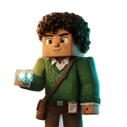

<div align="center">



<br/><br/>

**[▸ portfolio](https://karan-anchan.github.io/)** &nbsp;·&nbsp;
**[▸ linkedin](https://linkedin.com/in/karan-anchan)** &nbsp;·&nbsp;
**[▸ email](mailto:kar.anchan02@gmail.com)** &nbsp;·&nbsp;
**[▸ cv](https://karan-anchan.github.io/CVKaranAnchan.pdf)**

</div>

<br/>



**M.Sc. Computer Science (AI)** · University of Freiburg · Freiburg im Breisgau 🇩🇪

RL on humanoids, detectors running in a browser tab, RAG in production, and agents
that watch my training runs while I sleep — research-grade when it needs rigor,
product-grade when it needs to ship. Hand me a strong paper and I'll rebuild it,
then push past it; hand me a vague problem and I'll scope it, build the pipeline,
and ship the unglamorous parts too.

`off the clock:` over-engineering n8n automations and defending masala chai against
German filter coffee — a study with n=1 and strong priors.

<br clear="right"/>

## ⛏ now training

| | | |
|---|---|---|
| 🟢 | **[rlpd-offline-to-online-rl](https://github.com/Karan-Anchan/rlpd-offline-to-online-rl)** | RLPD (ICML '23) reproduced & extended to Humanoid-v5 — symmetric sampling, LayerNorm critics, UTD 20 · *lab project, team of 3* |
| 🔵 | **[edge-yolo26-deployment](https://github.com/Karan-Anchan/edge-yolo26-deployment)** | one NMS-free detector → TensorRT INT8 / ONNX CPU / WebGPU, a latency-per-watt study under a ≤2% mAP budget |

## 🗺 the 2026 run — a menu, not a mandate

```text
ckpt 01  ●● now     world-model RL on Crafter (DreamerV3)  ·  reasoning via GRPO/RLVR
ckpt 02  ◐◐ next    efficient-inference lab (quant × spec-decode × KV-cache)  ·  diffusion LM vs AR twin
ckpt 03  ○○ queued  robotics VLA fine-tune (LIBERO)  ·  multi-agent n8n capstone with pass^k evals
```

## 🧰 stack

| | daily drivers | solid | learning |
|---|---|---|---|
| **core** | Python · PyTorch | C++ · SQL | CUDA kernels |
| **research** | Transformers · MuJoCo · W&B | MONAI · PEFT | mamba-ssm |
| **systems** | Git · CI/CD | Docker · ONNX/TensorRT | vLLM internals |
| **agents** | — | LangChain · Chroma/Qdrant · n8n | MCP |

<br/>

<div align="center">

<sub>`handcrafted at 2am between training runs — the loss curve above? it converges.`</sub>

</div>
