<div align="center">


<br/><br/>

<a href="https://karan-anchan.github.io/"></a>&nbsp;
<a href="https://linkedin.com/in/karan-anchan"></a>&nbsp;
<a href="mailto:kar.anchan02@gmail.com"></a>&nbsp;
<a href="https://karan-anchan.github.io/CVKaranAnchan.pdf"></a>

<br/><br/>

<sub>🎮 &nbsp;flavor on the surface &nbsp;·&nbsp; 🔬 &nbsp;science inside the folds — <em>click the ▸ panels as you go</em></sub>

</div>


##  &nbsp;model card — `karan-v3`

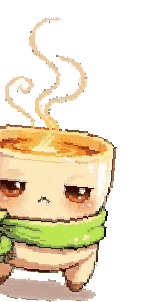

*Every model ships with a card. This one is self-reported but honestly benchmarked.*

| field | value |
|---|---|
| **architecture** | curiosity-driven · chai-cooled · stubbornly empirical |
| **pretraining** | B.E. Computer Science (9.33/10) → production ML internship |
| **fine-tuning** | M.Sc. Computer Science (AI) · University of Freiburg 🇩🇪 |
| **alignment** | to measured baselines — vibes are not an eval |
| **known limitations** | will re-run your experiment with 3 seeds before agreeing with it |
| **intended use** | research collaborations · working-student roles · hard problems |

<details>
<summary>&nbsp;🔬 &nbsp;<b>full spec sheet</b> — the verifiable part</summary>

<br/>

- **M.Sc. Computer Science (AI)** — Albert-Ludwigs-Universität Freiburg, Apr 2025 → present. Deep learning, probabilistic graphical models, statistical pattern recognition, robot mechanics.
- **B.E. Computer Science** — N.M.A.M. Institute of Technology, 2020 → 2024. GPA 9.33/10 (German equivalent 1,3).
- **ML Intern** — WiZdom Ed, Oct 2023 → Oct 2024. Production RAG over 5,000+ documents (LangChain + ChromaDB); ingestion −40% via recursive splitting; cosine-similarity feedback loop → 90% answer accuracy.
- **Certifications** — [MLOps Specialization, Duke](https://coursera.org/verify/specialization/BC9VRBWCQRU5) · [ML Specialization, Stanford/DeepLearning.AI](https://coursera.org/verify/specialization/JDYYP28JPJNZ)
- **Languages** — English C2 · Hindi native · German A2 → B1
- **Base of operations** — Freiburg im Breisgau, DE · CET

</details>

<div align="center">

<a href="https://www.last.fm/user/KaranANchan22"></a>

<sub><code>the training soundtrack · live</code></sub>

</div>

<!-- spotify direct widget (needs Premium) parked at karanchan02125.pythonanywhere.com — swap back anytime -->


## 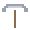 &nbsp;currently mining

*Two active veins. The minecart runs daily.*

<div align="center">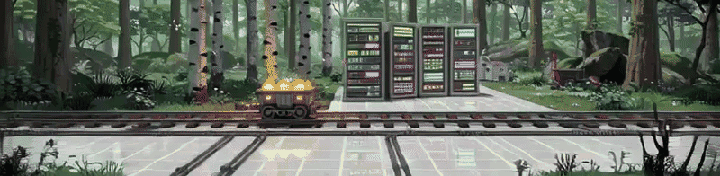</div>

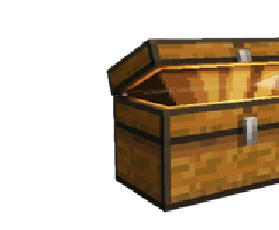

| | | |
|---|---|---|
| 🟢 | **[rlpd-offline-to-online-rl](https://github.com/Karan-Anchan/rlpd-offline-to-online-rl)** | teaching humanoids to walk from old data — then letting them loose online |
| 🔵 | **[edge-yolo26-deployment](https://github.com/Karan-Anchan/edge-yolo26-deployment)** | one detector, three runtimes, one question: who wins latency-per-watt? |

<details>
<summary>&nbsp;🔬 &nbsp;<b>run configs</b> — what's actually inside</summary>

<br/>

**rlpd-offline-to-online-rl** · *lab project, team of 3*
- Reproduction & extension of RLPD ([Ball et al., ICML 2023](https://arxiv.org/abs/2302.02948)) in PyTorch with Minari offline datasets
- Symmetric 50/50 offline/online sampling · LayerNorm critics · ensemble of 10 · UTD 20
- Reproduced across three MuJoCo locomotion suites, extended to Humanoid-v5 with ablations over sampling ratio, ensemble size and update-to-data ratio

**edge-yolo26-deployment**
- NMS-free YOLO26 fine-tune shipped to **TensorRT INT8** (RTX 5070), **ONNX Runtime QDQ INT8** (Ryzen 7700) and **WebGPU** in-browser
- MLPerf-style methodology: p50/p95/p99 latency, joules per frame, accuracy deltas under a ≤2% mAP budget
- PTQ calibration pipeline + reproducible benchmark harness

</details>


##  &nbsp;changelog

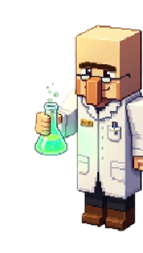

*Version history of the author. Semantic-ish.*

| | release | notes |
|---|---|---|
| 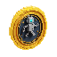 | `v2026.07` | **feat:** humanoids learn to walk from offline data *(seed 2 remains hostile)* |
| 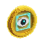 | `v2026.06` | **feat:** detector running in a browser tab via WebGPU |
|  | `v2025.04` | **major:** relocated to Freiburg — M.Sc. CS (AI), Albert-Ludwigs-Universität |
|  | `v2023.10` | **feat:** production RAG @ WiZdom Ed — 5k docs, 90% answer accuracy |
| 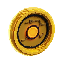 | `v2020.09` | **init:** B.E. Computer Science, first gradient descended |


## 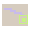 &nbsp;quest log · 2026

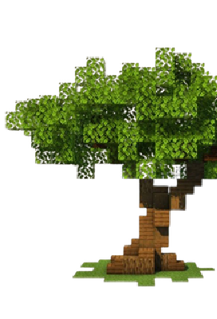

*The season pass. Progress bars update as runs converge.*

```text
[##########..............]  world-model RL on Crafter — DreamerV3, imagination ablations
[########................]  reasoning via GRPO/RLVR — the test-time-compute curve
[####....................]  efficient-inference lab — quant × spec-decode × KV-cache
[##......................]  diffusion LM vs a matched AR twin
[........................]  robotics VLA fine-tune (LIBERO) · n8n multi-agent capstone
```

<details>
<summary>&nbsp;🔬 &nbsp;<b>quest briefings</b> — papers behind each bar</summary>

<br/>

- **World-model RL** — DreamerV3 ([arXiv 2301.04104](https://arxiv.org/abs/2301.04104)) on Crafter at 1M steps; ablate imagination horizon (H = 5/15/30) and categorical vs Gaussian latents; render dream-vs-reality rollouts
- **GRPO / RLVR** — verifiable-reward post-training on math ([DeepSeekMath, arXiv 2402.03300](https://arxiv.org/abs/2402.03300)); measure accuracy vs samples-at-inference
- **Efficient inference** — GPTQ/AWQ × speculative decoding × KV-cache compression; a serving-throughput Pareto on one GPU
- **Diffusion LM** — masked-diffusion ([arXiv 2406.07524](https://arxiv.org/abs/2406.07524)) vs a compute-matched autoregressive twin
- **Robotics VLA** — SmolVLA/OpenVLA behaviour cloning on LIBERO; discrete-token vs flow-matching action heads
- **Agentic capstone** — n8n supervisor + RAG + tool-use pipeline with pass^k reliability evals

</details>


## 🐍 &nbsp;the commit garden

*A snake is released into my contribution graph every night at 04:00. It has never once been full.*

<div align="center"></div>

<div align="center">


<br/>


<br/><br/>

&nbsp;&nbsp;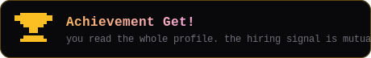&nbsp;&nbsp;

<br/>

<sub><code>no template survived contact with this readme · assembled by hand in freiburg</code></sub>

</div>
