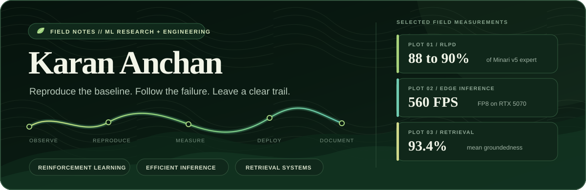
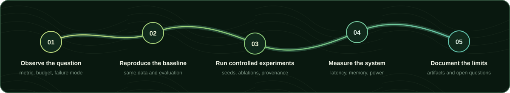
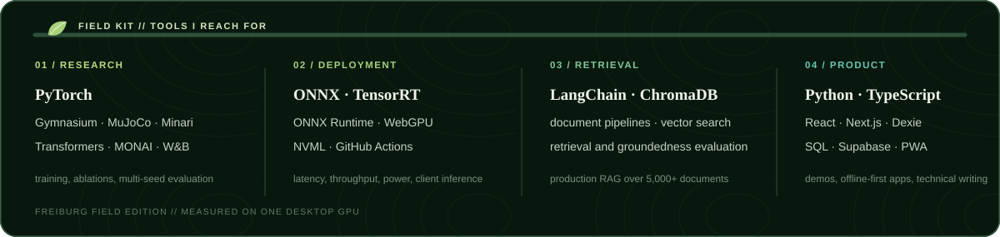

  

  <a href="https://karan-anchan.github.io/">Portfolio</a>
  &nbsp;·&nbsp;
  <a href="https://www.linkedin.com/in/karan-anchan/">LinkedIn</a>
  &nbsp;·&nbsp;
  <a href="mailto:kar.anchan02@gmail.com">Email</a>

I am an M.Sc. Computer Science student at the University of Freiburg, working mostly on reinforcement learning, efficient model inference, and retrieval systems. I like projects where the claim is specific enough to test: reproduce the baseline, hold the comparison still, measure the failure mode, and publish the run artifacts.

Most of the recent work below was trained and benchmarked on one RTX 5070. That constraint has made efficiency part of the research question, not an afterthought.

## Selected work

<table>
  <tr>
    <td width="50%" valign="top">
      
      <h3>Edge YOLO26 deployment</h3>
      
One detector exported to TensorRT, ONNX Runtime, and WebGPU. FP16 reached 536 FPS at 9.3 FPS/W with a 0.06% mAP drop; FP8 was fastest at 560 FPS. The same nominal INT8 precision produced an 8x accuracy-loss gap across runtimes.

      
<a href="https://github.com/Karan-Anchan/edge-yolo26-deployment">Repository</a> · <a href="https://karan-anchan.github.io/edge-yolo26-deployment/">Live WebGPU demo</a>

    </td>
    <td width="50%" valign="top">
      
      <h3>RLPD offline-to-online RL</h3>
      
A PyTorch reproduction with three seeds per method on Hopper, Walker2d, and HalfCheetah. RLPD reached 88.0, 89.6, and 88.6% of the Minari v5 expert return, with lower seed variance than IQL on all three tasks.

      
<a href="https://github.com/Karan-Anchan/rlpd-offline-to-online-rl">Repository</a> · 3 methods · 3 seeds · 245k steps

    </td>
  </tr>
</table>

## More experiments

| Project | What I built or measured | State |
|---|---|---|
| [English to Hindi Transformer](https://github.com/Karan-Anchan/en-hi-nmt-transformer) | A 43M parameter, 6-layer Transformer built directly in PyTorch and trained on 500k Samanantar pairs. Beam search reached 16.93 SacreBLEU and 41.58 chrF++ on 500 frozen test pairs, but cost 9.3x the latency. | Complete |
| [Mamba and attention hybrid LM](https://github.com/Karan-Anchan/mamba-hybrid-lm) | A roughly 50M parameter ratio study at matched tokens seen. The reduced-scale 1:7 preview leads at 102.4 validation perplexity; inference speed and KV-cache measurements are still open. | In progress |
| [UNETR 3D abdomen segmentation](https://github.com/Karan-Anchan/Unetr_3D_Abdomen_Segmentation) | A MONAI pipeline for 14-class CT segmentation with resampling, balanced 128³ crops, and sliding-window inference. Validation Dice was 0.8027 on one split. | Complete |
| [Arise](https://github.com/Karan-Anchan/arise) | An offline-first fitness RPG built with React 19, TypeScript, Dexie, and optional Supabase sync. Training history drives XP, quests, levels, and progression. | v1 complete |
| [RL foundations](https://github.com/Karan-Anchan/Windy_GridWorld_Sim) | NumPy implementations of [TD control](https://github.com/Karan-Anchan/Windy_GridWorld_Sim), [value iteration](https://github.com/Karan-Anchan/MDP_Optimal_Grid_Sim), and the [10-armed testbed](https://github.com/Karan-Anchan/10_Arm_Testbed). | Complete |

## Current focus

I am finishing the full Mamba ratio study and checking whether its perplexity result survives the measurements that matter at inference: tokens per second and KV-cache growth with context. Alongside that, my Freiburg coursework currently covers Bayesian hyperparameter optimization and multi-criteria optimization.

## Background

| When | Work |
|---|---|
| 2025 to present | M.Sc. Computer Science, Artificial Intelligence at the University of Freiburg. Current interests: reinforcement learning, efficient inference, and robotics. |
| 2023 to 2024 | Machine Learning Intern at WiZdom Ed. Built and evaluated a RAG study-path system over 5,000+ documents with LangChain and ChromaDB. A company-provided 100-batch evaluation reported 71.7% Recall@5, 93.4% groundedness, and 89.1% refusal accuracy. |
| 2020 to 2024 | B.E. Computer Science at N.M.A.M. Institute of Technology, GPA 9.33/10. |

## How I work

  

My repositories keep the result next to the conditions that produced it: configs, seeds, evaluation artifacts, hardware, and known limitations. Preview runs stay labeled as previews. Single-split validation stays labeled as validation.

## Working stack

  

## Contact

I am open to research collaborations, working-student roles, and internships in ML research or engineering. The easiest way to reach me is [email](mailto:kar.anchan02@gmail.com). More context and project write-ups are on my [portfolio](https://karan-anchan.github.io/).

<picture>
  <source media="(prefers-color-scheme: dark)" srcset="https://raw.githubusercontent.com/Karan-Anchan/Karan-Anchan/output/snake.svg" />
  <source media="(prefers-color-scheme: light)" srcset="https://raw.githubusercontent.com/Karan-Anchan/Karan-Anchan/output/snake-light.svg" />
  
</picture>
